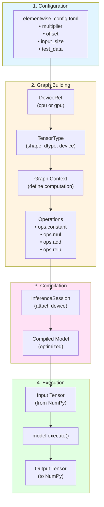
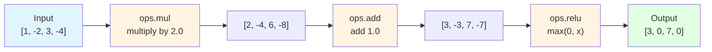

# Element-wise Operations Example

## Overview

This example demonstrates the simplest MAX Graph operations, supporting both CPU and GPU execution.

## MAX Graph API Workflow

Note: Mermaid diagrams render on GitHub. For local preview in VS Code, install the "Markdown Preview Mermaid Support" extension.

This example demonstrates the core MAX Graph API workflow:



## The Problem

We're computing a simple element-wise function:

```
y = relu(x * multiplier + offset)
```

Where:
- `x` is the input vector (configurable size, default: 4 elements)
- `multiplier` is a scalar constant (default: 2.0) broadcast to match input size
- `offset` is a scalar constant (default: 1.0) broadcast to match input size
- `relu` is the Rectified Linear Unit activation function

### Mathematical Operations

1. **Multiplication** (element-wise):
   ```
   z = x ⊙ multiplier
   ```
   Each element of x is multiplied by the multiplier value.
   
   Example: `[1, -2, 3, -4] * 2.0 = [2, -4, 6, -8]`

2. **Addition** (element-wise):
   ```
   w = z + offset
   ```
   The offset is added to each element.
   
   Example: `[2, -4, 6, -8] + 1.0 = [3, -3, 7, -7]`

3. **ReLU Activation**:
   ```
   y = max(0, w) = { w  if w > 0
                  { 0  otherwise
   ```
   Negative values become zero, positive values unchanged.
   
   Example: `relu([3, -3, 7, -7]) = [3, 0, 7, 0]`

### Complete Example

With default config (`multiplier=2.0`, `offset=1.0`, `input=[1, -2, 3, -4]`):



Or in table form:
```
Input:     [1,  -2,   3,  -4]
  ↓ *2
Multiply:  [2,  -4,   6,  -8]
  ↓ +1
Add:       [3,  -3,   7,  -7]
  ↓ relu
Output:    [3,   0,   7,   0]
```

## Files

- **`elementwise.py`** - Main example with TOML config support (CPU/GPU)
- **`elementwise_config.toml`** - Configuration for multiplier, offset, and test data

## Running the Example

```bash
# Run on CPU (default from config)
pixi run example-elementwise-cpu

# Run on GPU
pixi run example-elementwise-gpu

# Or directly with custom config
python examples/python/01_elementwise/elementwise.py --device cpu
python examples/python/01_elementwise/elementwise.py --device gpu --config my_config.toml
```

## Configuration

Edit `elementwise_config.toml` to change parameters:

```toml
[graph]
multiplier = 2.0  # Change computation
offset = 1.0
input_size = 4

[test_data]
input_values = [1.0, -2.0, 3.0, -4.0]  # Change test input

[device]
default = "cpu"  # Change default device
```

## Apple Silicon GPU Findings

### Current Status (January 2026)

Apple Silicon GPU support in MAX is **partial** - depends on kernel availability.

**Source**: Modular Discord feedback:
> "That's mostly a matter of adding kernels for it. There are still a few kernels without generic fallbacks, but some models in MAX might work."

### Experiment Results

#### Element-wise Operations

**Operations tested**:
- `ops.mul` - Element-wise multiplication
- `ops.add` - Element-wise addition  
- `ops.relu` - Element-wise ReLU

**Result**: ✅ **WORKING!** Element-wise operations run successfully on GPU

```
✓ Accelerator device found: Device(type=gpu,id=0)
✓ Graph 'elementwise_gpu' created
✓ Graph compiled and loaded on GPU
✓ Inference executed on GPU
✓ Results match NumPy validation
```

**Initial Issue**: Xcode 26 doesn't include Metal Toolchain by default

**Fix**:
```bash
# Download Metal Toolchain for Xcode 26
xcodebuild -downloadComponent MetalToolchain
```

**What this revealed**:
- Xcode 26 changed to on-demand component downloads (like iOS SDKs)
- Metal tools are ~750MB and must be explicitly downloaded
- Once installed, GPU compilation works perfectly for supported operations

#### Matrix Operations (see `02_linear_layer/`)

**Operations tested**:
- `ops.matmul` - Matrix multiplication
- `ops.transpose` - Matrix transpose
- `ops.add` - Addition
- `ops.relu` - ReLU

**Result**: ❌ Missing GPU kernel for `matmul`

```
✓ Accelerator device found: Device(type=gpu,id=0)
✓ Graph 'minimal_model_gpu' created
✗ Compilation failed: matmul kernel not available
```

**Error**:
```
max/kernels/src/linalg/matmul/gpu/_multistage_gemm_gpu.mojo:714:4: error: function instantiation failed
...
note: constraint failed: Current compilation target does not support operation: mma
```

**What this means**:
- `matmul` operation doesn't have GPU kernel for Apple Silicon yet
- Specifically missing: `mma` (matrix multiply-accumulate) operation
- Would need CPU fallback for models using matmul

## Key Takeaways

### What Works ✅
✅ **Element-wise operations on Apple Silicon GPU** (add, mul, relu)  
✅ GPU device detection
✅ Graph building for GPU
✅ Graph compilation for GPU (after Metal Toolchain install)
✅ GPU inference execution
✅ Correct results (validated against NumPy)

### What Doesn't Work Yet
❌ Matrix multiplication (`matmul`) on GPU - missing kernel
❌ Metal toolchain auto-configuration (manual download required)

### Implications for Our DistilBERT Model

Our DistilBERT implementation uses:
- Heavy use of `matmul` (every transformer layer)
- Attention operations (which use matmul)
- Feed-forward networks (which use matmul)

**Conclusion**: DistilBERT won't run on Apple Silicon GPU yet due to missing `matmul` kernels.

## Comparison to Other Frameworks

### MAX (Current)
- GPU kernels: Partial (element-wise ✅, matmul ❌)
- Requires: Xcode/Metal setup
- Status: Work in progress

### PyTorch with MPS
- GPU support: Complete for most operations
- Matmul: ✅ Works on Apple Silicon
- Status: Production-ready

### ONNX Runtime with CoreML
- GPU support: Via CoreML backend
- Status: Production-ready for inference

## Benchmarking

```bash
# Compare CPU vs GPU for fixed size
pixi run benchmark-elementwise

# Test scaling behaviour across sizes (4 to 8M elements)
pixi run benchmark-elementwise-sizes

# Or run directly
python benchmarks/01_elementwise/cpu_vs_gpu.py
python benchmarks/01_elementwise/cpu_vs_gpu_scaling.py
```

See [Apple Silicon GPU Findings](../../../docs/APPLE_SILICON_GPU_FINDINGS.md) for detailed results.

## Future Work

Once Metal toolchain is properly configured:
1. ✅ Element-wise operations should work on GPU
2. ❌ Matmul-based models still need CPU fallback
3. ⏳ Wait for Modular to add more GPU kernels

## References

- **MAX Documentation**: https://docs.modular.com/max/
- **MAX Graph Devices**: https://docs.modular.com/max/graph/devices
- **Modular Forums**: https://forum.modular.com
- **Modular Discord**: https://discord.gg/modular

## Contributing

If you get GPU execution working:
1. Document your setup steps
2. Note which operations work
3. Share findings in Modular Discord/Forums
