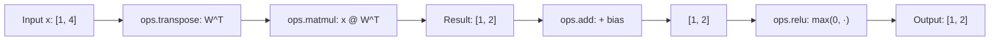

# Linear Layer Example

## Overview

Demonstrates a simple linear layer (fully connected layer) using MAX Graph. This is the next step up from element-wise operations, showing how to work with matrix operations.

Note: Mermaid diagrams render on GitHub. For local preview in VS Code, install the "Markdown Preview Mermaid Support" extension.

## The Problem

We're computing a linear layer with activation:

```
y = relu(W @ x + b)
```

Where:
- `x` is the input vector [batch_size, input_features]
- `W` is the weight matrix [output_features, input_features]
- `b` is the bias vector [output_features]
- `relu` is the activation function

### Computation Flow



With default config (4 → 2 linear layer, input=`[[1, 2, 3, 4]]`):

```
Input:     [[1.0, 2.0, 3.0, 4.0]]  (shape: [1, 4])
  ↓ matmul with W^T
Linear:    [[8.5, 0.1]]              (shape: [1, 2])
  ↓ add bias
Bias:      [[8.6, 0.0]]              (shape: [1, 2])
  ↓ relu
Output:    [[8.6, 0.0]]              (shape: [1, 2])
```

## Files

- **`linear_layer_minimal.py`** - ⭐ **Start here!** Self-contained minimal example (~140 lines)
- **`linear_layer.py`** - Full-featured example with TOML config support (CPU/GPU)
- **`linear_layer_config.toml`** - Configuration for weights and test data

### Which File to Use?

Both files are **functionally equivalent** - they perform the same linear layer computation (`y = relu(x @ W^T + b)`) and produce identical results. The difference is how the code is structured:

**Learning MAX Graph?** → Start with `linear_layer_minimal.py`
- **No abstractions** - all code inline, no helper functions
- **Graph construction highlighted** - clear 4-step flow:
  1. BUILD GRAPH
  2. COMPILE GRAPH
  3. RUN INFERENCE
  4. DISPLAY RESULTS
- ~140 lines focusing purely on MAX Graph API
- Shows matrix operations (matmul, transpose) explicitly
- Best for understanding core graph operations

**Experimenting with parameters?** → Use `linear_layer.py`
- TOML configuration for easy parameter changes
- CPU/GPU device switching via command-line
- Modular structure with helper functions

## Running the Examples

### Minimal Example (Recommended for Learning)

```bash
# Run the minimal, self-contained example
python examples/python/02_linear_layer/linear_layer_minimal.py
```

**Output**:
```
Building MAX Graph...
Linear layer: 4 → 2

✓ Graph built

Compiling graph...
✓ Graph compiled

Running inference...
✓ Inference complete

============================================================
RESULTS
============================================================
Operation: y = relu(x @ W^T + b)

Input shape:  (1, 4)
Weight shape: (2, 4)
Bias shape:   (2,)

Input:  [[1. 2. 3. 4.]]
Output: [[8.6 0. ]]

Expected (NumPy): [[8.6 0. ]]
Match: True
============================================================
```

### Full Example (With Configuration)

```bash
# Run on CPU (default from config)
pixi run example-linear

# Or directly with custom config
python examples/python/02_linear_layer/linear_layer.py --device cpu
python examples/python/02_linear_layer/linear_layer.py --device gpu --config my_config.toml
```

Note: GPU will fail due to missing matmul kernel on Apple Silicon.

## Configuration

Edit `linear_layer_config.toml` to change parameters:

```toml
[graph]
input_features = 4
output_features = 2
batch_size = 1

[weights]
W = [[1.0, 0.5, -0.5, 2.0], [-1.0, 0.5, 1.5, -2.0]]
b = [0.1, -0.1]

[test_data]
input_values = [[1.0, 2.0, 3.0, 4.0]]
```

## GPU Status

❌ **Not working on Apple Silicon GPU**: Requires `matmul` kernel which is not yet available.

See [Apple Silicon GPU Findings](../../../docs/APPLE_SILICON_GPU_FINDINGS.md) for details.

## How It Fits Into MAX Framework

### MAX Architecture Layers

```
┌─────────────────────────────────────────────┐
│  1. Define Graph (Python)                   │  ← This example focuses here
│     - Specify computation                   │
│     - Define input/output types             │
│     - Build operation sequence              │
└──────────────┬──────────────────────────────┘
               ↓
┌─────────────────────────────────────────────┐
│  2. Compilation (MAX Compiler)              │  ← Happens automatically
│     - Optimise operations                   │
│     - Fuse ops where possible               │
│     - Select hardware-specific kernels      │
└──────────────┬──────────────────────────────┘
               ↓
┌─────────────────────────────────────────────┐
│  3. Execution (MAX Runtime)                 │  ← model.execute()
│     - Run optimised code                    │
│     - Hardware-agnostic                     │
│     - High performance                      │
└─────────────────────────────────────────────┘
```

This example demonstrates **Step 1** (graph definition) and shows how Steps 2-3 happen seamlessly.

## Key Concepts Demonstrated

### 1. Graph Construction

```python
with Graph("minimal_model", input_types=[input_spec]) as graph:
    x = graph.inputs[0].tensor
    # ... operations ...
    graph.output(y)
```

**MAX docs**: [Graph Construction](https://docs.modular.com/max/graph/)

### 2. Operations (ops)

```python
y = ops.matmul(x, ops.transpose(W, 0, 1))  # Matrix multiply
y = ops.add(y, b)                           # Add bias
y = ops.relu(y)                             # Activation
```

All operations are **declarative** - you describe *what* to compute, not *how*.

**MAX docs**: [Operations Reference](https://docs.modular.com/max/graph/ops)

### 3. Device Handling

```python
device = CPU()                              # Create device
session = InferenceSession(devices=[device])  # Session for compilation
```

MAX abstracts hardware - same code works on CPU, NVIDIA GPU, AMD GPU, etc.

**MAX docs**: [Device Management](https://docs.modular.com/max/graph/devices)

### 4. Compilation & Execution

```python
model = session.load(graph)     # Compile (one-time cost)
output = model.execute(input)   # Run inference (fast!)
```

**Compilation** happens once, **execution** is the fast path.

## Running the Example

```bash
# From repository root
pixi run python examples/python/minimal_max_graph.py
```

**Expected output**:
```
=== Minimal MAX Graph Example ===

1. Building computation graph...
   Graph 'minimal_model' created

2. Creating inference session and compiling graph...
   Graph compiled and loaded

3. Preparing input...
   Input shape: (1, 4)
   Input data: [[1. 2. 3. 4.]]

4. Executing inference...
   Output shape: (1, 2)
   Output data: [[8.6 0. ]]

5. Verifying with NumPy...
   Expected: [[8.6 0. ]]
   Match: True

✓ Complete!
```

## What Makes This "Minimal"?

1. **Inline weights**: Uses `ops.constant()` instead of loading from files
2. **Single layer**: Just one matmul + bias + activation
3. **Fixed shapes**: No dynamic batch sizes or variable length
4. **No model file**: Weights defined in code, not loaded

This keeps the example focused on **MAX Graph API fundamentals**.

## Comparison to Real Models

### This Example

```python
# Weights defined inline
W = ops.constant(np.array([[...]], dtype=np.float32), ...)

# Simple operation
y = ops.matmul(x, ops.transpose(W, 0, 1)) + b
```

### Real Model (e.g., DistilBERT)

```python
# Weights loaded from file
weights = load_weights([model_path])
W = weights.layer.weight.allocate(DType.float32).cast(dtype)

# Complex operations
embeddings = self.embeddings(input_ids)
hidden = self.encoder(embeddings, attention_mask)
logits = self.classifier(hidden[:, 0, :])
```

**Key difference**: Real models load weights from files and have many layers. The **graph construction pattern** is the same.

## Next Steps

After understanding this example:

1. **distilbert_sentiment.py** - See how a real model uses MAX Graph
2. **src/python/max_distilbert/** - Study a complete transformer implementation
3. **MAX Graph Tutorial** - [Build LLM from Scratch](https://llm.modular.com)

## MAX Framework Resources

- **MAX Documentation**: https://docs.modular.com/max/
- **MAX Graph API**: https://docs.modular.com/max/graph/
- **Graph Operations**: https://docs.modular.com/max/graph/ops
- **Device Management**: https://docs.modular.com/max/graph/devices
- **Modular Forums**: https://forum.modular.com

## Common Patterns

### Linear Layer

MAX doesn't have `ops.linear()`, use this pattern:

```python
output = ops.matmul(x, ops.transpose(W, 1, 0)) + bias
```

### Device Consistency

All ops must use the same device:

```python
device = x.device  # Get device from input
const = ops.constant(value, dtype=dtype, device=device)
```

### Shape Inspection

During development, print shapes:

```python
print(f"Tensor shape: {tensor.shape}")
```

## Troubleshooting

### "Device mismatch" errors

**Problem**: Operations on different devices

**Solution**: Pass `device=x.device` to all `ops.constant()` calls

### "Incompatible function arguments" in InferenceSession

**Problem**: Using `DeviceRef` instead of `CPU()`

**Solution**: Use `CPU()` for session:
```python
device = CPU()  # Not DeviceRef
session = InferenceSession(devices=[device])
```

### Import errors

**Problem**: MAX not installed

**Solution**: Run `pixi install` to set up environment

## Why MAX Over Alternatives?

**vs PyTorch**: No training overhead, better inference performance, hardware-portable

**vs ONNX Runtime**: Programmatic graphs (not file-based), more flexible

**vs TensorRT**: Not locked to NVIDIA, works on Apple Silicon + AMD

**Trade-off**: Compilation overhead (~seconds) vs inference speed (5-6x faster)

See also: `docs/MAX_FRAMEWORK_GUIDE.md` for detailed comparison.
